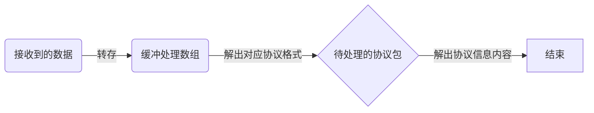

@[TOC](数据处理流程) 

# 总体流程
>在两个设备对接通讯时都会用到协议处理的功能，将接受的协议数据接收到后解包后得到传输的内容，下面写一下轮询方式的流程处理过程
>
>	PushToComFIFO(RecBuffer,BufLen);
>	if(GetDataFromComFIFO(ComStr))
>	{
>		Command_Class(ComStr);
>	}


>上面就是协议处理的整体框架，先将从硬件接口上接收到的数据（RecBuffer）根据长度（BufLen）放入到处理缓冲中(ComFIFO)，然后从缓冲数据中读出需要的符合协议规则的数据包（ComStr），最后在对得到的数据包解析，读出其中包含的内容。如果该硬件接口接收的数据中包含不同地协议格式，可以根据设置不同的GetDataFromComFIFO返回值判断之后进行哪个协议解包。如下：

     switch(ComType)
     {
    	case CMD_7D7E:
    		Command_Class_7D7E(ComStr);
    		break;
    	case CMD_$RN:
    		Command_Class_$RN(ComStr);
    		break;
    	default;break;
    }
# 数据放入缓冲   
> PushToComFIFO(RecBuffer,BufLen);
> -
> 将数据放入缓冲的作用主要是为了方便组包，因为接口收到的数据有可能不是完整的一包数据，通过写指针(FIFOWritePos)可以将多次接收的数据顺序的放在同一个缓冲数组中,其中FIFO_SIZE为缓冲数组长度

```
Void PushToComFIFO(uint8_tDataBuffer[],conset int DataBufsize)`
{
	static int i;
	for(i=0;i<DataBufsize;i++)
	{
		ComFIFO[FIFOWritePos++]=DataBuffer[i];
		if(FIFOWritePos>=FIFO_SIZE)
		{
			FIFOWritePos=0;
		}
	}
}

```
# 从数据缓冲中解包协议格式-读缓冲
>GetDataFromComFIFO(ComStr);
>-
>通过判断读指针和写指针是否在同一位置，得知数据缓冲中是否有待处理数据，并将该数据放入DataBuffer中依次传给Get_XXX_Msg函数判断是否符合协议格式，直到待处理数据全部处理完毕。
```
bool GetDataFromComFIFO(uint8_t* DataBuffer)
{
	static int sync =false;
	static int DataIndex =0；
 	while(FIFOReadPos!=FIFOWritePos)
	{
		DataBuffer[DataIndex ]=ComFIFO[ReadIndex++];
		if(FIFOReadPos>=FIFO_SIZE)
		{
			FIFOReadPos=0;
		}
		if(Get_XXX_Msg(&sync,&DataIndex ,DataBuffer)}
		{
			DataIndex =0;
			return ture;
		}
	}
	return false;

}
```
# 从数据缓冲中解包协议格式-协议格式解析
>Get_XXX_Msg(&sync,&DataIndex ,DataBuffer)
>-
>函数先判断是否符合协议包头，在检测到包头后会将检测状态标志*p_sync置位，该值从外部传入可以防止多处调用造成的逻辑错误。之后
>就会判断是否到包尾部位置，过程中判断DataBuffer数组长度*p_DataIndex是否超定义长度，防止数组溢出。检测到尾部后下面函数就得到了$G.........*  格式的协议包DataBuffer，同时状态标志清零并返回Get_XXX_Msg函数的协议获取状态ture。

```
bool Get_XXX_Msg(int* p_sync,int* p_DataIndex ,uint8_t DataBuffer)
{
	
	if(*p_sync||((*p_DataIndex==0)&&(DataBuffer[0]=="$")||(*p_DataIndex==1)&&(DataBuffer[1]=="G")))
	{
		*p_DataIndex++;
		if(*p_DataIndex>=2)
		{
			*p_sync=ture;
		}
	}
	if(*p_DataIndex>=255)
	{
		*p_DataIndex=0;
		*p_sync=false;
	}
	if(*p_sync&&(DataIndex(*p_DataIndex-1)=="*"))
	{
		*p_sync=false;
		return ture;
	}
}
else
{
	*p_sync=false;
	if(*p_DataIndex==1)
	{
		*p_DataIndex=1;
	}
	else
	{
		*p_DataIndex=0;
	}
}
```
>如果协议有校验位需要校验可以在协议格式解析中加入校验计算或获得协议包后再在进行校验，校验方式按协议要求进行校验


```
 if(Get_XXX_Msg(&sync,&DataIndex ,DataBuffer)}
 {
		DataIndex =0;
			//校验
		if(Check(DataBuffer))
		return ture;
}

```
>有的协议没有包尾通过包长度来代替包尾检测确定结束协议帧检测，但这个一般有校验过程，需要在检测协议的同时进行校验

>另外在传输Hex协议时为了防止协议内容干扰到包头包尾的判断，通常会将协议内容和包头尾一样的字节进行转义，比如7E转义位7D 5E、7D转义位7D 5D 在接收数据时就要将该数据转义回来
>接收完数据数对DataBuffer进行重新处理
>发送端如果有校验位一般都是先校验再转义发送，所以接收方需要先转义后才能进行校验计算。
```
for(i=0,n=0;i<DataIndex;i++,n++)
{
	if((DataBuffer[i]==0x7D)&&(DataBuffer[i+1]==0x5E))
	{
		DataBuffer[n]=0x7E;
		i++;
	}
	else if((DataBuffer[i]==0x7D)&&(DataBuffer[i+1]==0x5D))
	{
		DataBuffer[n]=0x7D;
		i++;
	}
	else
	{
		DataBuffer[n]=DataBuffer[i];
	}
	if(Check(DataBuffer))
	{
		return ture;
	}
}
```

# 从协议包格式中解出内容信息
>Command_Class(ComStr);
>-
>按照不同的协议规则，在处理上也有不同地处理方式,ASCII协议时可以使用如下函数，其中GetSubItem函数为取数的具体方法。
>在得到cBufOut后有的需要进行转换得到要求的数据，比如使用atoi、atof、 sscanf、strtol等函数得到包含的数据，Num1、Num2.


```
void Command_Class(uint8_t *Buffer)
{
	char Status = 0;
	char cBufOut[256];
	
	Status = GetSubItem(Buffer, strlen(Buffer),3,cBufOut);
	if(Status)
	{
		Num1 = atof(cBufOut);
	}
	Status = GetSubItem(Buffer, strlen(Buffer),4,cBufOut);
	if(Status)
	{
		Num2 = atof(cBufOut);
	}
}
```
>GetSubItem(Buffer, strlen(Buffer),3,cBufOut);
>-
>该函数功能是报文数据区域数据提取,根据具体协议用来分隔数据内容的方式实现读取Buffer相应分割区域的内容到cBufOut，如下代码内容是解析通过“，”分隔内容的代码，3表示第3块分隔的区域如"$Gxxx,xxx,123,....*"其中123为解出的数据被传递给cBufOut。
>或者在下面代码中if (Buffer[i] == (char)(',') || Buffer[i] == (char)('*'))更改分隔方式。
>另外按照协议需求更改，如以下代码表示只接收数字和相应符号的ASCII字节，如不要求数据格式可去掉该限制选择。
>if((cBufOut[j] == '+')||(cBufOut[j] == '-')||(cBufOut[j] == '.')||((cBufOut[j]>= 0x30)&&(cBufOut[j]<= 0x39)))
```

char GetSubItem(const char Buffer[], const int BufferSize, const int ItemIndex, uint8_t cBufOut[])
{
	int i,j;
	int CommCnt = 0;
	int CommaPoint = -1;
	int PreCommaPoint = -1;
	int BufOutSize;
	if (ItemIndex == 1)
	{
		return 0;
	}
	if (cBufOut == 0)
	{
		return 0;
	}
	if (Buffer == 0)
	{
		return 0;
	}
	for (i=0; i<BufferSize; i++)
	{
		if (Buffer[i] == (char)(',') || Buffer[i] == (char)('*'))
		{
			CommCnt++;
			if (CommCnt == ItemIndex)
			{
				CommaPoint = i;
				BufOutSize = CommaPoint-PreCommaPoint-1;
				if(BufOutSize>20)
				{
					BufOutSize = 20;
				}
				if (BufOutSize > 0)
				{
					strncpy(cBufOut, Buffer+PreCommaPoint+1, BufOutSize);
					cBufOut[BufOutSize] = '\0';
					for(j=0; j< BufOutSize; j++)
					{
						if((cBufOut[j] == '+')||(cBufOut[j] == '-')||(cBufOut[j] == '.')||((cBufOut[j]>= 0x30)&&(cBufOut[j]<= 0x39)))						
						{
							j = j;
						}else
						{
							return 0;
						}	
					}					
					return 1;
				}
				else
					return 0;				
			}
			else
			{
				PreCommaPoint = i;
			}			
		}
	}
	return 0;
}
```
>Hex协议大部分的协议是按固定的位置进行解析的，直接按位置分隔信息内容，或是也有一些按照ASCII码协议分隔方法进行处理


以上代码环境 ：keil+c+stm32。